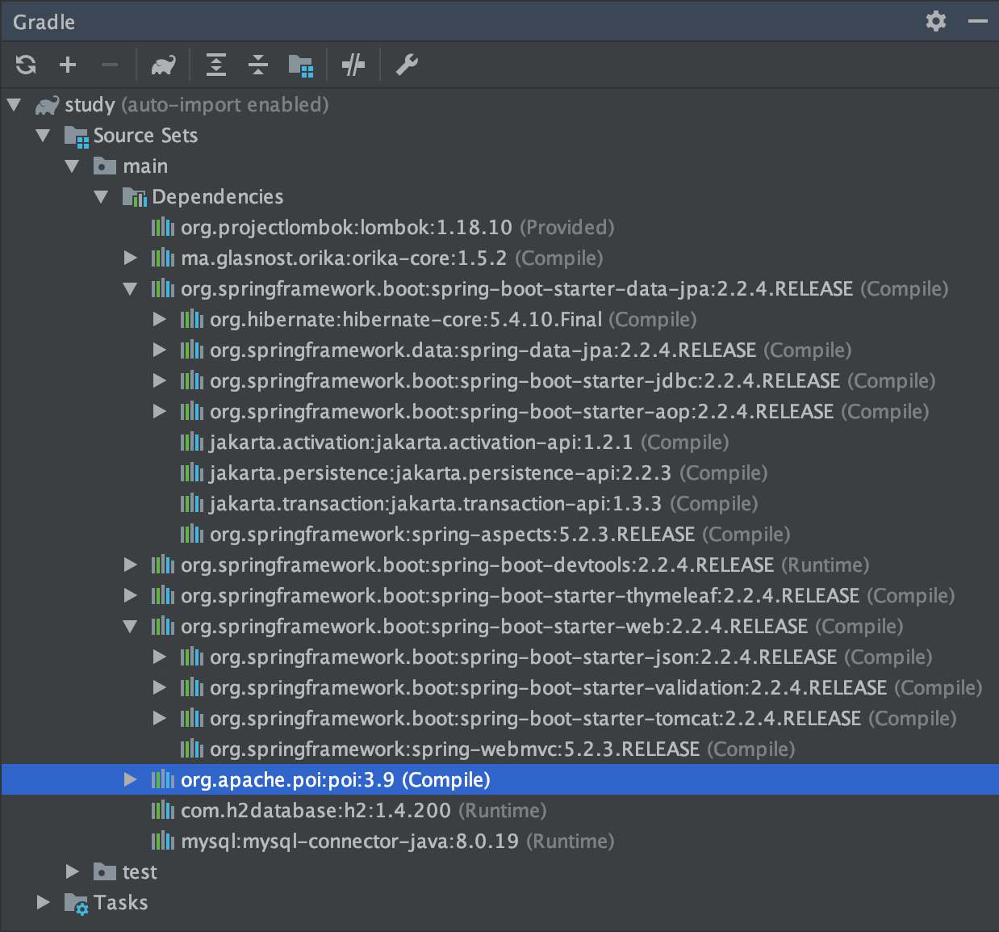
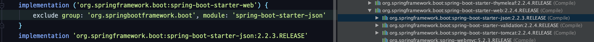
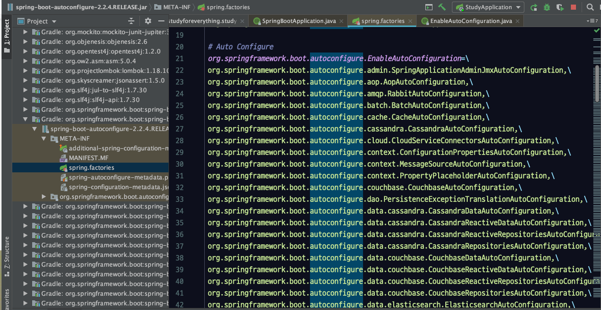
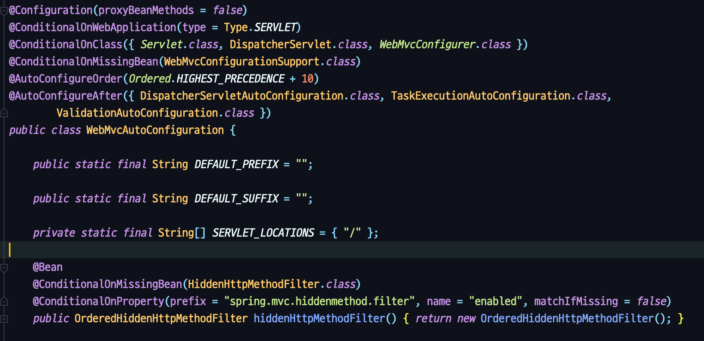

# 스프링 부트의 개념과 활용

## 스프링 부트 소개

스프링 부트는 제품 수준의 스프링 기반의 애플리케이션을 빠르고 쉽게 만들 수 있도록 도와준다. 

토이 프로젝트 용이 아니다. 제품 수준이다. 지금 회사에서도 스프링 부트 쓴다. 

opinionated view를 제공함.

opinionated view : 스프링의 판단하에 best practice라고 생각하는 설정 컨벤션을 말함.

### 요구 사항

Java8,  SpringFramework 5.0.7 버전 이상을 사용해야 한다. 

### 스프링 부트 시작하기

IntelliJ에서 Spring initializer를 사용해서 스프링 부트 프로젝트를 생성하거나 [https://start.spring.io/](https://start.spring.io/) 에서 생성해서 사용하면 됨. 구체적인 사용법은 필요 할 때 찾아서 쓰면 될 듯. 

    groupId : 패키지 명을 입력
    
    - groupId는 당신의 프로젝트를 모든 프로젝트 사이에서 고유하게 식별하게 해 주는 것이다.
    - 따라서, groupId에는 네이밍 스키마를 적용하도록 한다.
        - groupId는 package 명명 규칙을 따르도록 한다.
        - 즉, 최소한 당신이 컨트롤하는 도메인 네임이어야 한다.
        - 하위 그룹은 얼마든지 추가할 수 있다.
        - 예: `org.apache.maven`, `org.apache.commons`
    
    artifactId : 원하는 이름을 주면 됨
    
    - artifactId는 버전 정보를 생략한 `jar` 파일의 이름이다.
        - 이름은 원하는 것으로 아무거나 정해도 괜찮다.
        - 단, 소문자로만 작성하도록 한다.
        - 단, 특수문자는 사용하지 않는다.
    - 만약 써드 파티 `jar` 파일이라면, 할당된 이름을 사용해야 한다.
        - 예: `maven`, `commons-math`
    
        참고 : [https://johngrib.github.io/wiki/groupId-artifactId/](https://johngrib.github.io/wiki/groupId-artifactId/)

## 스프링 부트 프로젝트 구조

main Class는 최상위 패키지에 위치하는 것을 추천함. componentScan때문에.

componentScan은 main class가 위치해 있는 패키지를 포함해서 그 이하의 패키지를 scan함

## 의존성 관리 이해

설정한 것도 없는데 스프링 부트는 어떻게 그 많은 의존성을 다 알아서 추가했는가?

dependency management 기능을 제공함.

    plugins {
        id 'org.springframework.boot' version '2.2.4.RELEASE'
        id 'io.spring.dependency-management' version '1.0.9.RELEASE' // dependency-management!!
        id 'java'  // jar 파일 설정을 자동으로 해줌
    }
    
    group = 'com.studyforeverything'
    version = '0.0.1-SNAPSHOT'
    sourceCompatibility = '1.8'
    
    configurations {
        developmentOnly
        runtimeClasspath {
            extendsFrom developmentOnly
        }
        compileOnly {
            extendsFrom annotationProcessor
        }
    }
    
    repositories {
        mavenCentral()
    }
    
    dependencies {
        compile('ma.glasnost.orika:orika-core:1.5.2')
        compile('ma.glasnost.orika:orika-core:1.5.2')
        implementation 'org.springframework.boot:spring-boot-starter-data-jpa'
        implementation 'org.springframework.boot:spring-boot-starter-thymeleaf'
        implementation 'org.springframework.boot:spring-boot-starter-web'
        implementation 'org.apache.poi:poi:3.9'
        compileOnly 'org.projectlombok:lombok'
        developmentOnly 'org.springframework.boot:spring-boot-devtools'
        runtimeOnly 'com.h2database:h2'
        runtimeOnly 'mysql:mysql-connector-java'
        annotationProcessor 'org.projectlombok:lombok'
        testImplementation('org.springframework.boot:spring-boot-starter-test') {
            exclude group: 'org.junit.vintage', module: 'junit-vintage-engine'
        }
    }
    
    test {
        useJUnitPlatform()
    }

- spring-boot-dependency에서 관리하는 의존성은 버전을 명시하지 않아도 됨.
    - 자신이 특별히 사용하고 싶은 버전이 있다면 명시할 수도 있음.
- springboot-dependency에서 관리하지 않는 의존성은 버전을 명시해야 함.
    - 아래와 같이 해주니 의존성이 변경되었다.

    

## 자동 설정 이해

스프링 부트 애플리케이션은 bean을 두 번 등록한다. 

1. ComponentScan
    1. @Component annotation이 달린 클래스를 스캔해서 bean으로 등록함
2. EnableAutoConfiguration

### @EnableAutoConfiguration

아래의 클래스들이 bean 등록의 대상이 된다.

모두 bean으로 등록이 되는 건 아니고 각 클래스마다 조건이 달려 있음.

@Conditional의 조건에 따라서 bean등록이 됨.

## 자동 설정 만들기 1부 : Starter와 AutoConfigure

maven으로 프로젝트를 jar파일로 만들어서 로컬에서 해당 프로젝트를 사용하는 것을 gradle로 하는 방법

`실패`

[https://www.irgroup.org/gradle-local-repository-install/](https://www.irgroup.org/gradle-local-repository-install/)

## 내장 웹 서버 이해

스프링 부트는 웹 서버가 아니다!

톰캣, 제티, 네티 등이 서버이다.

스프링 부트를 실행하면

톰캣 생성, 포트 설정, 서블릿 생성, 서블릿 추가, 서블릿 매핑 등등의 작업이 이뤄진다.

TomcatServletWebServerFactory에서 아래와 같이 tomcat을 생성하는 등의 작업을 한다.

    @Override
    	public WebServer getWebServer(ServletContextInitializer... initializers) {
    		if (this.disableMBeanRegistry) {
    			Registry.disableRegistry();
    		}
    		Tomcat tomcat = new Tomcat();
    		File baseDir = (this.baseDirectory != null) ? this.baseDirectory : createTempDir("tomcat");
    		tomcat.setBaseDir(baseDir.getAbsolutePath());
    		Connector connector = new Connector(this.protocol);
    		connector.setThrowOnFailure(true);
    		tomcat.getService().addConnector(connector);
    		customizeConnector(connector);
    		tomcat.setConnector(connector);
    		tomcat.getHost().setAutoDeploy(false);
    		configureEngine(tomcat.getEngine());
    		for (Connector additionalConnector : this.additionalTomcatConnectors) {
    			tomcat.getService().addConnector(additionalConnector);
    		}
    		prepareContext(tomcat.getHost(), initializers);
    		return getTomcatWebServer(tomcat);
    	}

DispatcherServletAutoConfiguration에서 DispatcherServlet도 만들어줌 

dispatcherServle은 HttpServlet을 상속해서 만든 스프링 프레임워크의 핵심 servlet이다.

servlet container는 달라질 수 있다. 그러나 servlet은 변하지 않기 때문에 servlet의 생성과 container에 등록하는 것이 다른 위치에서 이루어진다.

## 내장 웹 서버 응용 1부 : 컨테이너와 포트

스프링 부트를 사용하면 자동설정에 의해 톰캣을 사용하게 된다.

톰캣이 아닌 다른 서블릿 컨테이너를 사용하는 방법.

    build.gradle
    
    implementation ('org.springframework.boot:spring-boot-starter-web') {
            exclude group: 'org.springframework.boot', module: 'spring-boot-starter-tomcat'
        }
    implementation 'org.springframework.boot:spring-boot-starter-jetty'

웹 서버를 끄고 실행하기

    application.properties
    
    spring.main.web-application-type=none

포트 변경하기

    application.properties
    
    server.port=8010

랜덤 포트 사용하기

    application.properties
    
    server.port=0

ApplicationListener<ServletWebServerInitializedEvent>

웹서버가 생성되면 servletSebServerInitializedEvent가 호출됨

## 내장 웹 서버 응용 2부 : HTTPS와 HTTP2

http2를 사용하려면 ssl이 적용되어야 함

undertow의 경우엔 `server.http2.enabled` 설정을 application.properties에 추가하면 됨. 서버마다 설정이 다름. 

tomcat은 9.0, java 9 이상 사용할 경우에는 설정이 간단하지만 그 이하의 버전에서는 복잡함. 

## 독립적으로 실행 가능한 JAR

mvn package를 실행하면 jar 파일이 생성됨

모든 의존성이 jar 파일에 다 들어있음.