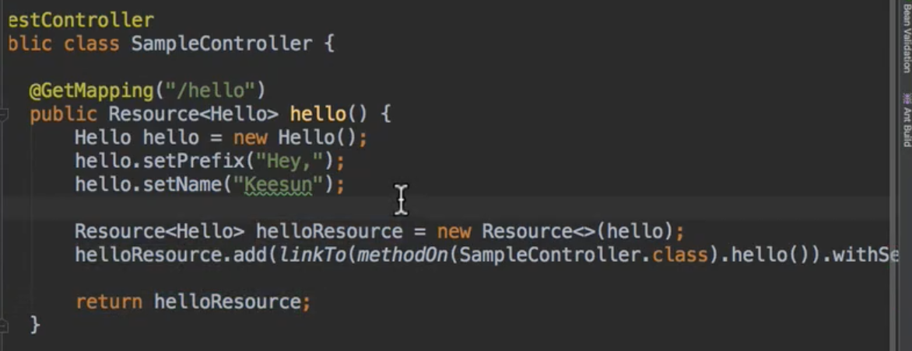

# week5_study

> 강의문서 외, 스터디 중 추가로 논의한 내용

### 정적 리소스 지원

- Last-Modified 헤더를 보고 304 응답을 보냄.
    - 크롬에서 확인 가능 - Request Header의 If-Modified-Since
    - 304 - 200과 달리 리소스를 다시 보내진 않음, 효율적
- `ResourceHttpRequestHandler`가 처리함.
    - WebMvcConfigurer의 addResourceHandlers로 커스터마이징 할 수 있음
    - → 기본 4가지에 추가적으로 ResourceHandler 추가 가능

    @Override
    public void addResourceHandlers(ResourceHandlerRegistry registry) {
    	registry.addResourceHandler("/m/**")
    		.addResourceLocations("classpath:/m/") // 주의 - 끝부분 '/'로 끝나야함
    		.setCachePeriod(20);
    }

### JSP를 권장하지 않는 이유

- JAR 패키징 할 때는 동작하지 않고, WAR 패키징 해야 함. ← 스프링부트의 지향 방향과 충돌
- 최근에 만들어진 Undertow는 JSP를 지원하지 않음.
- https://docs.spring.io/spring-boot/docs/current/reference/htmlsingle/#boot-features-jsp-limitations
- Thymeleaf와 달리 렌더링된 뷰 결과까지 테스트할 수 없다. (사실 그렇게까지 테스트하는 일은 잘 없지만)

    JSP는 서블릿엔진이 뷰를 만드는데 함께 동작하기 때문. (?) 반면 타임리프는 타임리프 템플릿 엔진이 별도로 동작하므로, 서블릿은 무관, 따라서 실제 서블릿을 띄우지 않는 WebMvcTest&MockMvc 환경에서도 테스트 할 수 있는 것.

### Spring HATEOAS

- Link 정보를 추가하는 방법

    다양하다. 그 중 (Spring꺼 말고) HATEOAS 의존성의 "Resource"를 활용하는 방법

    HATEOAS의 Resource = 우리가 제공하는 기본 리소스 + 링크 정보

    

- 그래서, 결국 HATEOAS란 ..?

    REST API의 정점.

    진정한 REST API 라면 이정도는 해야지!의 느낌?

    이를 위한, 고급 API를 만드는 방법

### 인메모리 데이터베이스

### 스프링 데이터 Repository 테스트 만들기

- @DataJpaTest (슬라이스 테스트) 작성
    - 기본적으로 임베디드 DB 쓰도록 설정되있음
    - H2 DB 테스트 의존성 추가
- best practice
    - @SpringBootTest로 해도 되지만, **@DataJpaTest**가 훨씬 빠르다.
    - 테스트에선, 실제 DB보단 **H2**가 빠르기도 하고 안전하기도 하다.

### JPA를 사용한 데이터베이스 초기화

- `spring.jpa.hibernate.ddl-auto`
    - none
    - update, create, create-drop - 운영에서 사용 ㄴㄴ
    - validate - 링크, 테이블 연결 검증만 하고, 스키마 생성은 하지 않음
- `spring.jpa.generate-ddl`
    - true/false