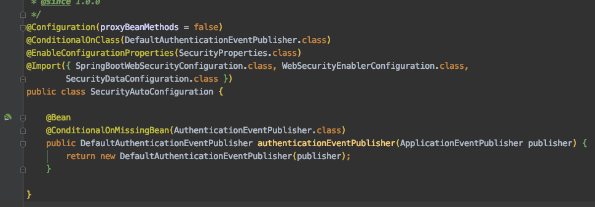

# week6_study

> 강의문서 외, 스터디 중 추가로 논의한 내용

### 48~50. Redis, MongoDB, Neo4j

- 대표 NoSQL
    - Redis - **캐시, 메시지 브로커, 키/밸류 스토어 등**으로 사용 가능.
    - [MongoDB](https://www.mongodb.com/)는 **JSON 기반의 도큐먼트 데이터베이스**입니다.
    - [Neo4j](https://neo4j.com/)는 노드간의 연관 관계를 영속화하는데 유리한 **그래프 데이터베이스** 입니다.
- 데이터 저장하는 방식 크게 2가지
    1. ~Template류 사용
    2. ~Repository류 사용

---

### 삼천포 - ViewController

다음과 같은 아무일도 하지않고 바로 뷰 네임을 리턴하는 컨트롤러라면, ViewController로 등록해도 된다.

    @GetMaping("hello")
    public String hello() {
    	return "hello";
    }

    @Configuration
    public class WebConfig implements WebMvcConfigurer {
    	@Override
    	public void addViewControllers(ViewControllerRegistry registry) {
    		registry.addViewController("/hello").setViewName("hello");
    	}
    }

---

# 52. 스프링 시큐리티 1부: spring-boot-starter-security

### 스프링 부트 시큐리티 자동 설정

- spring-boot-starter-security
    - 스프링 시큐리티 5.* 의존성 추가

### `SecurityAutoConfiguration`

- *이 부분은 부트가 사실 별 거 하지 않는다. 시큐리티 설정 거의 그대로 가져옴*

- 인증 관련 각종 이벤트 발생 (좌측 사진)
    - `DefaultAuthenticationEventPublisher` 빈 등록
    - 다양한 인증 에러 핸들러 등록 가능
- 모든 요청에 인증이 필요함 (우측 사진)
    - WebSecurityConfigurerAdapter 빈이 없으면, 시큐리티의 WebSecurityConfigurerAdapter의 설정을 그대로 따라간다. (DefaultConfigurerAdapter에서 상속받고 아무것도 하지않았으므로)

- `WebSecurityConfigurerAdapter`
    - 좌측처럼 기본설정을 하며
    - 우측처럼 "모든 요청을 가로채 인증이 필요하도록 설정, formLogin을 사용하겠다 등"

### `UserDetailsServiceAutoConfiguration`

- 기본 사용자 생성
    - 위 코드에서 확인할 수 있듯이, UserDetailService.class 빈이 없으면, InMemoryUserDetailManager 뭐 이런걸 이용해서 기본 유저를 하나 만든다. password는 콘솔에 출력됨.
    - Username: user
    - Password: 애플리케이션을 실행할 때 마다 랜덤 값 생성 (콘솔에 출력 됨.)

        

    - spring.security.user.name
    - spring.security.user.password

### 스프링 부트 시큐리티 테스트

- https://docs.spring.io/spring-security/site/docs/current/reference/html/test-method.html
- dependency : spring-security-test
- @WithMockUser 등

---

# 53. 스프링 시큐리티 2부: 시큐리티 설정 커스터마이징

### 1. 웹 시큐리티 설정

    @Configuration
    public class WebSecurityConfig extends WebSecurityConfigurerAdapter
    { 
    	@Override 
    	protected void configure(HttpSecurity http) throws Exception { 
    		http.authorizeRequests() 
    				.antMatchers("/", "/hello").permitAll() // "/my"페이지는 인증 필요하도록
    				.anyRequest().authenticated() 
    				.and() 
    			.formLogin() 
    				.and() 
    			.httpBasic(); 
    	}
    }

### 2. UserDetailsServie 구현

https://docs.spring.io/spring-security/site/docs/current/reference/htmlsingle/#jc-authentication
-userdetailsservice

### 3. PasswordEncoder 설정 및 사용

위 단계까지 하고, admin 유저를 하나 만들어서 로그인 시도해도 에러난다. PasswordEncoder를 설정하지 않았기 때문. 사실 저렇게 비밀번호를 평문으로 저장하는게 말이 안된다.

따라서 이후 PasswordEncoder 종류가 다양하므로 하나를 선택해 구현하면 된다.

    // Bean 등록 - 예제는 docs에서 추천하는 PasswordEncoderFactories 활용
    PasswordEncoderFactories.createDelegatingPasswordDecoder();
    
    // UserDetailsService구현체에서 인코더 빈 주입받은 후, 인코딩해서 저장
    account.setPassword(passwordEncoder.encode(password));

저거 말고 NoOpPasswordEncoder라는걸 빈 등록하면, 인코딩 안하고 저장해도 로그인 되긴한다. 하지만 저건 암복호화 안하는 방식이므로 실제 서비스에서 절대 쓰면 안된다.

https://docs.spring.io/spring-security/site/docs/current/reference/htmlsingle/#core-services-pa
ssword-encoding

*Spring Security TODO : 어떤 요청을 시큐리티로 처리할지 필터링, CSRF, 인증방식 OAuth, rest api로 유저 생성, Form 화면 등 앞으로 할 일은 많다.*

---

# 54. 스프링 REST 클라이언트 1부: RestTemplate과 WebClient

### 예제

RestTemplate은 일반적인 동기로 5초 실행후, 3초 실행, 총 8초 걸린다

WebClient는 run() 메소드 자체는 동기로 바로 끝까지 실행된다.

이후 hello/world에서 응답이 도착하면 `s → { ... }` 람다식이 async로 호출되어 실행된다.

    @Component
    public class RestTemplateClient implements ApplicationRunner {
    
        @Autowired
        private RestTemplateBuilder restTemplateBuilder;
    
        @Override
        public void run(ApplicationArguments args) throws Exception {
            RestTemplate restTemplate = restTemplateBuilder.build(); // 중간에 커스터마이징 가능
    
            StopWatch stopWatch = new StopWatch();
            stopWatch.start();
    				
    				// hello API - sleep 5초
            String hello = restTemplate.getForObject("http://localhost:8080/hello", String.class);
            System.out.println(hello);
    
    
    				// world API - sleep 3초
            String world = restTemplate.getForObject("http://localhost:8080/world", String.class);
            System.out.println(world);
    
            stopWatch.stop();
            System.out.println(stopWatch.prettyPrint());
        }
    }

    @Component
    public class WebClientClient implements ApplicationRunner {
    
        @Autowired
        private WebClient.Builder webClientBuilder;
    
        @Override
        public void run(ApplicationArguments args) throws Exception {
            WebClient webClient = webClientBuilder.build();
    
            StopWatch stopWatch = new StopWatch();
            stopWatch.start();
    
            // hello
            Mono<String> helloMono = webClient.get().uri("http://localhost:8080/hello")
                    .retrieve()
                    .bodyToMono(String.class);
    
            helloMono.subscribe(s -> {
                System.out.println(s);
                if (stopWatch.isRunning()) stopWatch.stop();
                System.out.println(stopWatch.prettyPrint());
                stopWatch.start();
            });
    
            // world
            Mono<String> worldMono = webClient.get().uri("http://localhost:8080/world")
                    .retrieve()
                    .bodyToMono(String.class);
    
            worldMono.subscribe(s -> {
                System.out.println(s);
                if (stopWatch.isRunning()) stopWatch.stop();
                System.out.println(stopWatch.prettyPrint());
                stopWatch.start();
            });
        }
    }

---

# 스프링 부트 Actuator

*주의 : Actuator에 Spring Security 걸어서 반드시 접근 제한하기 !*

- **JMX 또는 HTTP를 통해 접근 가능 함.**
    - JConsole
    - VisualVM
    - HTTP
    - Spring-boot-admin (third-party)