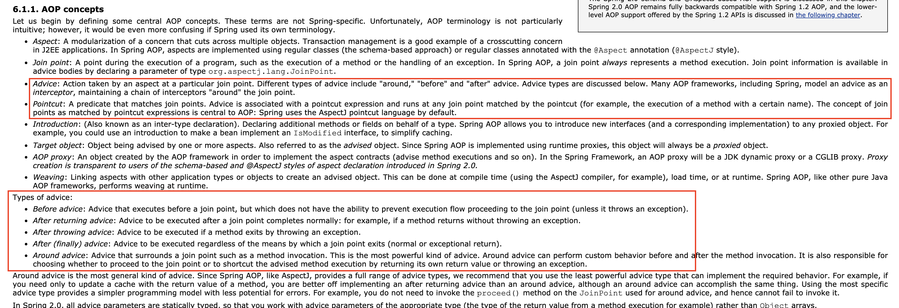

# week2_study

> 강의문서 외, 스터디 중 추가로 논의한 내용

### **Spring AOP는 AspectJ보다 제한적이라서, Join Point로 필드 접근 시점 등은 설정할 수 없다. "메소드 호출 시점"만 가능하다.**

### **Joint Point vs Advice**

https://docs.spring.io/spring/docs/2.0.x/reference/aop.html

### **jdk Dynamic Proxy vs CGLib**

- Spring Boot - CGLib 기본
- Spring (core) - jdk Dynamic Proxy 기본 + CGLib도 포함(v3.2부터)
- 참고자료
    - http://wonwoo.ml/index.php/post/1708
    - http://wonwoo.ml/index.php/post/1576

### **Tip : Spring Boot 서버모드 끄고, 일반 main()처럼 실행시키기 (기능 동작후 프로그램 종료)**

- SpringApplication을 기본적인 static 방식보다 다음과 같이 실행시키면, 서버 모드가 아니라서 구동후 바로 꺼진다. 속도도 빠르다.

- 빈과 관련된 간단한 기능 동작과 출력으로 디버깅할 때 유용할 듯

### **Spring AOP - @Around는 파라미터로 ProceedingJoinPoint를 받기 때문에, 꼭 pjp.proceed()를 실행해줘야 원본 객체의 메소드가 수행된다.**

### **인텔리제이 플러그인 - 소나린트 추천**